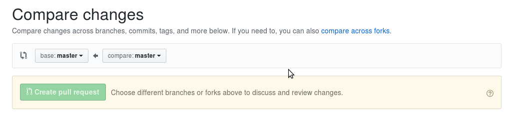

# HOW TO INSTALL AND CONFIG GIT FOR THIS PROJECT

## * Install Git for Windows 
[click me](https://gitforwindows.org/)

## * configure git globally
    git config --global "user.name" <firstName lastName>
    git config --global "user.email" <yourGitHubEmail>

## * Navigate to where you want your project
run `git clone https://github.com/mulvenstein/csc16-final-project.git`
in the terminal.

# USING GIT FOR THIS PROJECT

* never push to master.

* checkout your own branch.
    git checkout -b <yourname>

* when you have a working feature...(navigate to your directory)
    git add .
    git  commit -m "<describe what you added"
    git push -u origin <yourname>

* Log into github and find our repo.
Follow this picture

